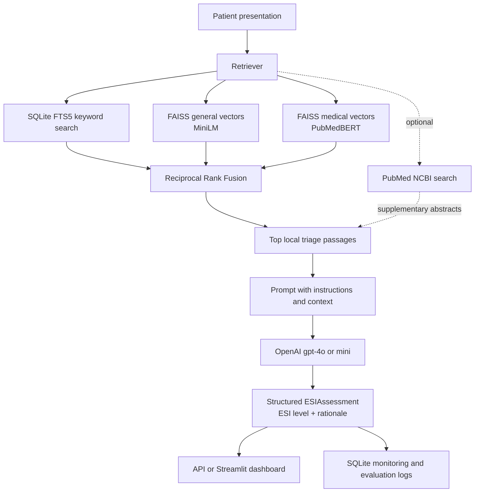

# Urgent Triage RAG Assistant

A RAG-based urgent care triage assistant, built for the LLM Zoomcamp course.

## The problem

In an emergency department, a triage nurse has only a couple of minutes to
look at a patient's symptoms and vital signs and assign an **Emergency
Severity Index (ESI)** level from 1 (resuscitate immediately) to 5 (least
urgent) — a decision that determines how quickly that patient gets seen.
The official ESI handbook and related guidelines run to dozens of pages of
rules, decision trees, and edge cases, which is a lot to hold in your head
under time pressure.

This project is a RAG (Retrieval-Augmented Generation) assistant that takes
a free-text patient presentation (symptoms, vitals, history) and:
1. retrieves the most relevant passages from the ESI handbook and related
   triage manuals (e.g. from United Nations) for that presentation, and
2. passes these pages/chunks of pages to an LLM, which based on the literature
   and the user prompt, return a structured ESI level
   (1-5) plus a rationale citing the source material.

It's meant as a decision-support aid, or as a help for nursing
students practicing for an exam.

## How it works (example)

**Input** (`POST /query`):
> A 28-year-old patient presents with generalized abdominal pain. Her last
> menstrual period is reported as 8 weeks ago. Vital signs are as follows:
> T 36.7°C (98°F), HR 120 beats/minute, RR 22 breaths/minute, and BP
> 92/50mm Hg.

**Output:**
> ESI is 2. Her increased heart rate, decreased respiratory rate... wait —
> her increased heart rate, elevated respiratory rate, and decreased blood
> pressure make her high risk. This presentation could indicate internal
> bleeding from a ruptured ectopic pregnancy (ESI Handbook, Decision Point
> B, "high-risk situation" list).

The query is embedded/keyword-searched (depends on the retrieval method used) against the
knowledge base, the top-matching passages are put in the LLM's context, and
the LLM is instructed to only answer using that context (or say "I don't
know" / decline off-topic questions). See [docs/pipeline.md](docs/pipeline.md)
for the full flow.

## Overview

### Architecture
- **Knowledge Base**: Medical triage manuals (PDFs), leaflets with triage algorithm depictions and handbooks, extracted & chunked
- **Storage**: persistent storage using SQLite database
- **Retrieval**: Hybrid approach comparing text search, vector search (general or medical embeddings) and hybrid search (a combination of each of these elements)
- **LLM**: GPT-4o-mini (configurable) and GPT-4o for triage reasoning, with structured (ESI level + rationale) output
- **Interface**: FastAPI (backend) + Streamlit (monitoring dashboard)
- **Orchestration**: dlt for the data ingestion pipeline
- **Containerization**: everything is in docker-compose

See [docs/pipeline.md](docs/pipeline.md) for a diagram, plain-English
description, and tool breakdown of each phase (ingestion, data prep,
retrieval, retrieval evaluation, RAG, RAG evaluation), including evaluation
results.

### Evaluation Strategy
- **Ground Truth for retrieval evaluation**: triage queries (`data/test_queries.json['retrieval_queries']`).
  They were obtained from the ESI handbook, which is a part of our knowledge base.
  In the handbook, there were 11 examples, consisting of a patient presentation and their
  ESI score, together with the reasoning behind the score assignment.
  We identified which passages in the handbook are the basis for the ESI assessment in each example
  manually and with the help of the Claude AI model. Then we searched for this passage in the DB
  (```chunks```) to obtain the ```chunk_id``` of the passage. The pairs of the ```query```,
  which is the patient presentation, and the ```chunk_id``` constitute ground truth
  for retrieval in the json file. Then these examples with the answers
  were redacted from the original pdf. Only the redacted version was used for retrieval evaluation
  and in the whole rag workflow
- **Ground Truth for LLM evaluation**: triage queries (`data/test_queries.json['llm_queries']`),
  the questions and answers are taken from various NCLEX-style emergency nursing exam questions
  found online
- **Metrics**: retrieval hit rate/MRR, and LLM triage-level accuracy/answer rate
- **Best Practices**: hybrid search (reciprocal rank fusion), comparing multiple embedding models, structured LLM output

## Evaluation Criteria

For reviewers grading against the LLM Zoomcamp criteria, here is how each
criterion is addressed in this project:

### Problem Description

The README explains the emergency-department triage problem, the role of ESI
levels, and how this assistant supports a nurse under time pressure. The
intended use and limitations are described in [The problem](#the-problem).

### Retrieval Flow

The application retrieves passages from a local medical persistent knowledge base using
keyword search, two embedding-based searches, and hybrid search before calling
the LLM. The complete flow is documented in [docs/pipeline.md, Retrieval](docs/pipeline.md#3-retrieval), 
[docs/pipeline.md, RAG](docs/pipeline.md#5-rag), and the [RAG Flow](#rag-flow) diagram below.

### Retrieval Evaluation

Seven retrieval methods are compared against hand-labeled queries using hit
rate, MRR, overlap, and source analysis, with the strongest approach selected
for the application. See [Retrieval Evaluation](docs/pipeline.md#4-retrieval-evaluation) and [the results](docs/pipeline.md#7-retrieval-evaluation-results).

### LLM Evaluation

The project evaluates 2 LLMs and 3 retrieval methods, together 6 combinations, against known ESI
answers, measuring both triage-level accuracy and answer rate (how many times ESI was a part of the response). The procedure
and results are in [RAG Evaluation](docs/pipeline.md#6-rag-evaluation) and [the results](docs/pipeline.md#8-rag-evaluation-results).

### Interface

The system provides a FastAPI endpoint for programmatic queries and a Streamlit
dashboard for interactive use and monitoring. See [src/api.py](src/api.py), [src/dashboard.py](src/dashboard.py), 
and [docs/pipeline.md, API and Dashboard](docs/pipeline.md#9-api).

### Ingestion Pipeline

The dlt pipeline detects added, removed, or changed PDFs and automatically
triggers data preparation only when the source corpus changes. Its flow is
described in [Ingestion](docs/pipeline.md#1-ingestion).

### Monitoring

SQLite logs retrieval results, LLM calls, token and cost metrics, latency, and
user feedback, while the Streamlit dashboard presents operational and
evaluation views. See [Dashboard](docs/pipeline.md#10-dashboard) and [src/db.py](src/db.py).

### Containerization

Docker Compose runs the ingestion, API, dashboard, and evaluation services from
the project configuration. The commands and service URLs are documented in
[docs/usage.md](docs/usage.md).

### Reproducibility

The repository includes setup and usage instructions, pinned dependencies in
`uv.lock`, evaluation data, and the local source corpus needed to recreate the
pipeline. See [docs/setup.md](docs/setup.md) and [docs/usage.md](docs/usage.md).

### Best Practices

Hybrid search is implemented and evaluated by combining keyword and vector
retrieval with reciprocal rank fusion; the details are in [Retrieval](docs/pipeline.md#3-retrieval). 
Document re-ranking and user query rewriting were considered but are not currently implemented.

### Bonus Points

No cloud deployment is currently included; the
application is designed to run locally or through Docker Compose.

### Knowledge Base

The local knowledge base contains PDF guidance used for urgent-care and
emergency triage: the **Emergency Severity Index (ESI) Handbook, 5th Edition**;
the **Interagency Integrated Triage Tool (IITT) adult, pediatric, reference
card, and mass-casualty guidance**; and the **MCM triage guidance note**. The
ESI handbook is the primary source for assigning ESI levels, while the IITT and
other guidance broaden coverage for adult, pediatric, and mass-casualty
presentations. The redacted ESI handbook is used for processing; the unredacted
copy is retained as the original source.

### RAG Flow

For a patient presentation, the application searches the local SQLite FTS5
index and two FAISS vector indices, combines the selected rankings with
reciprocal rank fusion, and sends the retrieved passages to the configured
OpenAI model. The model returns a structured ESI level and rationale, and the
request plus token, cost, latency, and prediction data are logged for later
evaluation and dashboard monitoring. Optional PubMed retrieval can add live
supplementary abstracts.



See [docs/pipeline.md](docs/pipeline.md#3-retrieval) for retrieval details and
[docs/pipeline.md](docs/pipeline.md#5-rag) for the generation step.

## Demo

Here are screenshots demonstrating the response to a relevant and irrelevant prompt.
You can also see user feedback buttons in action:


Here are screenshots demonstrating the Dashboard before any data (llm calls) are recorded in the db:


And then, after a few queries, the 5 plots it contains.


## Quick Start

The fastest way to run everything (ingestion, API, dashboard) is Docker —
see [docs/usage.md](docs/usage.md). Summary:

```bash
cp .env.example .env
# edit .env with your OPENAI_API_KEY (NCBI_API_KEY is optional)
docker compose up --build
```

This gives you the API at http://localhost:8000/docs and the dashboard at
http://localhost:8501. See `.env` for all supported environment
variables.

To run the pieces manually instead (e.g. for development), see
[docs/setup.md](docs/setup.md).

## Project Structure

```
├── knowledge_base/          # Medical PDFs (triage manuals, ESI handbook)
├── src/
│   ├── ingest_pipeline.py  # dlt pipeline: detect changed PDFs, trigger data_prep
│   ├── data_prep.py        # Extract & chunk PDFs, create text + vector indices
│   ├── db.py                # SQLite schema/access (chunks, retrieval results, llm calls, feedback)
│   ├── retrieval.py        # Retrieval methods (text/vector/hybrid/NCBI)
│   ├── evaluate_retrieval.py # Retrieval hit rate / MRR vs ground truth
│   ├── analyze_retrieval.py  # Retrieval overlap/source analysis
│   ├── rag.py                # Retrieve + prompt + LLM call (RAGBase)
│   ├── evaluate_llm.py       # RAG accuracy/answer-rate across models & retrieval approaches
│   ├── api.py                # FastAPI backend
│   ├── dashboard.py          # Streamlit monitoring dashboard
│   └── ...
├── data/                    # Generated: app.db (SQLite), vector_store_general/, vector_store_medical/, retrieval_analysis.json
└── docs/
    ├── pipeline.md          # Phase-by-phase diagrams, tools, and results
    ├── setup.md             # Manual/local setup
    └── usage.md             # Running via Docker, sharing the app
```

## Retrieval Methods Compared

1. **Text Search** - Keyword-based lookup (fast, interpretable)
2. **Vector Search (General)** - General embeddings (sentence-transformers)
3. **Vector Search (Medical)** - Medical embeddings (PubMedBERT)
4. **Hybrid** - Reciprocal rank fusion of text + vector methods

Results and evaluation metrics are stored in the SQLite db (`data/app.db`)
and summarized in `data/retrieval_analysis.json` — see
[docs/pipeline.md](docs/pipeline.md#7-retrieval-evaluation-results) for the
current numbers.


