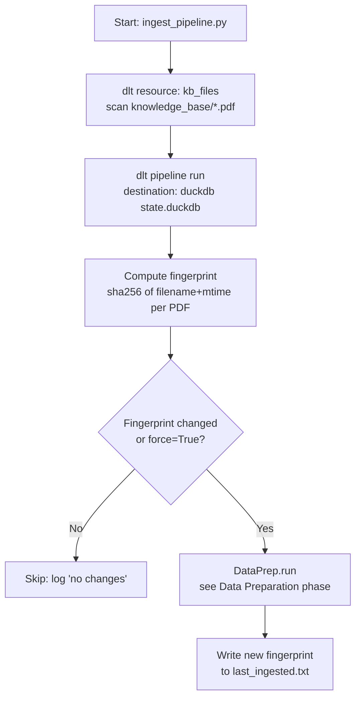
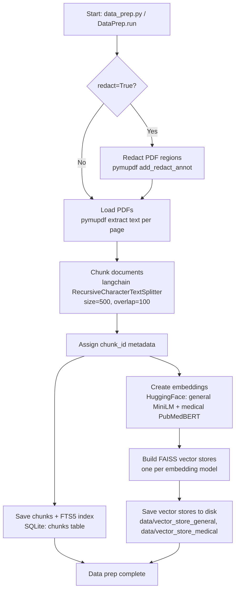
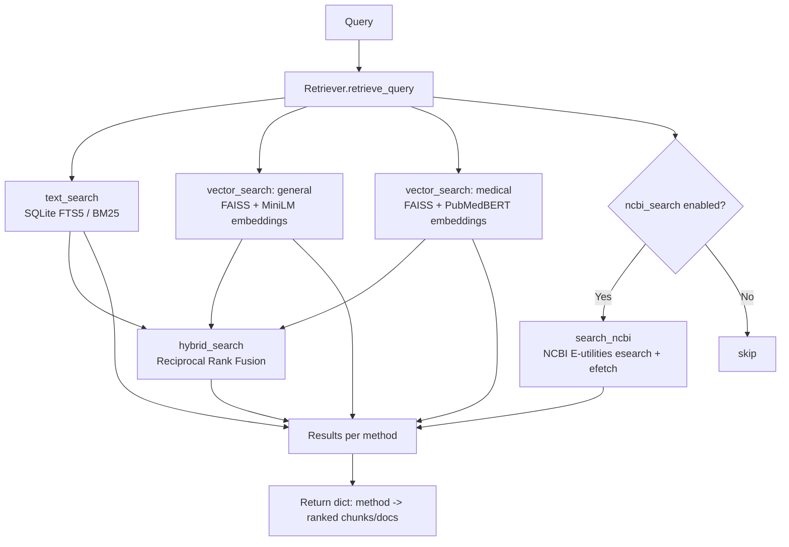
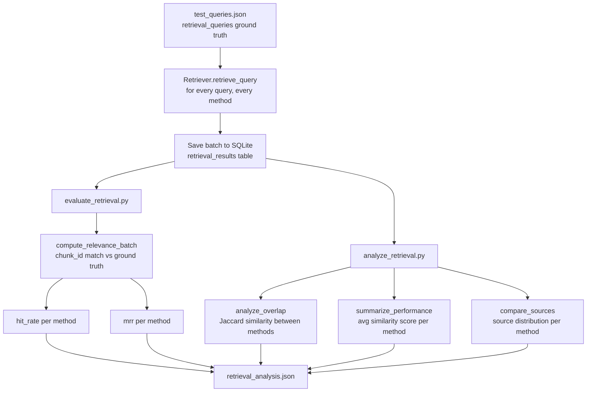
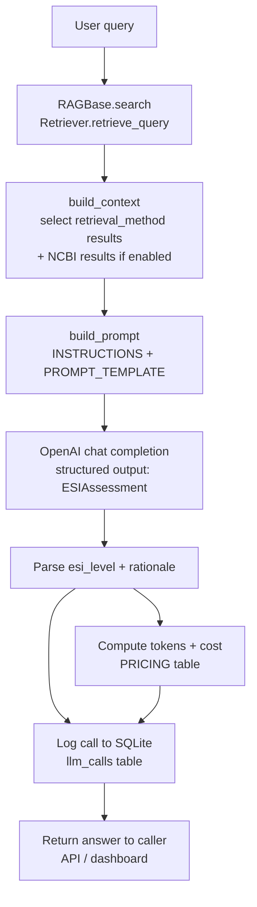
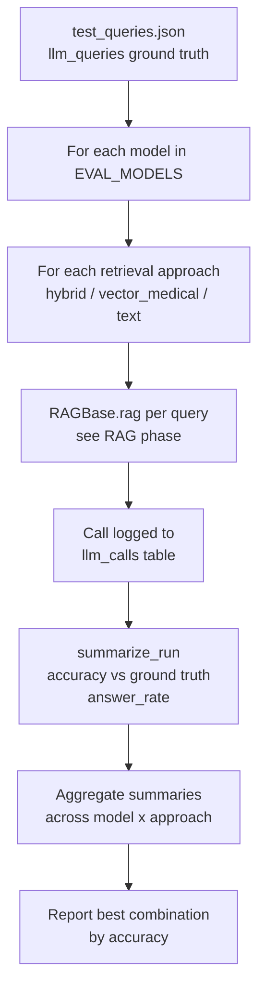

# Pipeline

This project turns a folder of medical triage PDFs into a RAG assistant that
assigns an Emergency Severity Index (ESI 1-5) level to a described patient
presentation. It runs as six phases: ingest new source documents, prepare
(chunk + embed) them, retrieve relevant passages for a query, evaluate
retrieval quality, generate a triage answer with an LLM (RAG), and evaluate
that LLM output. Each phase below shows its flow, the tools used, and the
notable alternatives we didn't use.

## Table of Contents

1. [Ingestion](#1-ingestion)
2. [Data Preparation](#2-data-preparation)
3. [Retrieval](#3-retrieval)
4. [Retrieval Evaluation](#4-retrieval-evaluation)
5. [RAG](#5-rag)
6. [RAG Evaluation](#6-rag-evaluation)
7. [Retrieval Evaluation Results](#7-retrieval-evaluation-results)
8. [RAG Evaluation Results](#8-rag-evaluation-results)
9. [API](#9-api)
10. [Dashboard](#10-dashboard)

---

## 1. Ingestion

Watches the `knowledge_base/` folder and only re-runs data preparation when a
PDF was added, removed, or changed, so the (slow) chunking/embedding step
isn't repeated on every container start.

**Tools used:** [dlt](https://dlthub.com/) for the pipeline/state, DuckDB as
dlt's local destination for the file-tracking table, plain `hashlib` for
change detection.

**Not used:** Airflow — this is one linear job with no branching, retries-per-task,
or cross-DAG dependencies, so a full scheduler + webserver + metadata DB would
be unnecessary operational overhead for a single-container batch job.

---

## 2. Data Preparation

Extracts text from the source PDFs, splits it into overlapping ~500-character
chunks, and indexes those chunks two ways: a keyword index (SQLite FTS5) and
two vector indices built with different embedding models, so retrieval
quality can be compared later.

**Tools used:** PyMuPDF for PDF text extraction/redaction, LangChain's
`RecursiveCharacterTextSplitter` for chunking, HuggingFace `sentence-transformers`
(general-purpose MiniLM and domain-specific PubMedBERT) for embeddings, FAISS
for the vector stores, SQLite (with the FTS5 extension) for chunk storage and
keyword search.

**Not used:** a managed vector DB (Qdrant/Pinecone/Weaviate) — the corpus is a
handful of PDFs (low thousands of chunks), so a local FAISS index is enough
and avoids running/paying for an extra service. Also didn't use Elasticsearch
for keyword search, since SQLite FTS5 gives BM25-style ranking with zero
extra infrastructure at this scale.

---

## 3. Retrieval

Given a query, runs every retrieval method in parallel (text, both vector
indices, and RRF-combined hybrids) so the outputs can be compared directly.
Optionally also queries PubMed live for supplementary evidence.

**Tools used:** SQLite FTS5 (text), FAISS + HuggingFace embeddings (vector),
in-house reciprocal rank fusion for hybrid search, NCBI E-utilities API
(`urllib`) for optional live PubMed lookups.

**Not used:** a re-ranker model (e.g. cross-encoder) — RRF over multiple
retrievers already gave a reasonable ranking signal for this corpus size, and
adding a re-ranker would mean another model to load/serve for limited
expected gain here.

---

## 4. Retrieval Evaluation

Runs a small hand-labeled set of triage queries (each mapped to the
`chunk_id` that should be retrieved) through every retrieval method, then
scores each method with hit rate and MRR, and separately checks how much the
methods agree with each other (Jaccard overlap) and which source documents
they favor.

**Tools used:** plain Python for the metrics (hit rate, MRR, Jaccard overlap),
SQLite for storing the raw retrieval batch, JSON for the ground truth and the
final report.

**Not used:** RAGAS or a similar off-the-shelf RAG-evaluation framework — the
ground truth here is chunk-id based (does the method retrieve the *known
correct* chunk), which a few lines of hit-rate/MRR code answer directly
without pulling in a framework built more for LLM-judged answer relevance.

---

## 5. RAG

Takes a free-text patient presentation, retrieves supporting context with one
configurable retrieval method, and asks an LLM to return a structured
ESI level (1-5) plus rationale, refusing to answer outside the triage domain.
Every call (tokens, cost, inputs/outputs) is logged for later evaluation and
monitoring.

**Tools used:** OpenAI Chat Completions API with Pydantic structured output
(`ESIAssessment`) for a guaranteed-shape response, SQLite for call logging.

**Not used:** a full orchestration framework (LangChain chains/LangGraph) for
the RAG step itself — the flow is a single retrieve-then-generate call, so a
plain Python class is simpler to read and debug than wrapping it in a chain
abstraction.

---

## 6. RAG Evaluation

Replays a ground-truth set of `{query, correct_answer}` pairs through every
combination of LLM model and retrieval approach, then compares them on
accuracy (does the predicted ESI level match) and answer rate (did the model
actually assign a level instead of declining).

**Tools used:** OpenAI models (`gpt-4o-mini`, `gpt-4o` by default, configurable
via `EVAL_MODELS`), SQLite for reading back logged calls, plain Python for
scoring.

**Not used:** an LLM-as-judge for free-text answer quality — ESI level is a
discrete 1-5 label, so exact-match accuracy against ground truth is a more
direct and reproducible signal than asking another LLM to judge similarity.

---

## 7. Retrieval Evaluation Results

From `data/retrieval_analysis.json` (11 ground-truth queries). *Numbers below
are from the current run in the repo — replace if you re-run the evaluation.*

| Method | Hit Rate | MRR |
|---|---|---|
| text_search | 0.182 | 0.121 |
| hybrid_search_text_and_vector_general | 0.091 | 0.091 |
| hybrid_search_text_and_vector_medical | 0.091 | 0.091 |
| hybrid_search_text_vector_general_and_medical | 0.091 | 0.091 |
| hybrid_search_vector_general_and_medical | 0.091 | 0.091 |
| vector_search_general | 0.091 | 0.018 |
| vector_search_medical | 0.091 | 0.091 |

Text search currently comes out ahead on both metrics, though all methods
score low in absolute terms — the ground-truth set is small (11 queries), so
these numbers should be treated as directional rather than conclusive. See
`data/retrieval_analysis.json` for per-method source distribution and
pairwise overlap between methods.

---

## 8. RAG Evaluation Results

Not run yet — `docker compose run eval` (or `python src/evaluate_llm.py`)
logs each call to `llm_calls` in the SQLite db and prints an accuracy /
answer-rate summary per model x retrieval approach, but doesn't persist that
summary to a file. Once a run is final, paste the printed summary table
here.

| Model | Retrieval approach | Accuracy | Answer rate |
|---|---|---|---|
| _pending_ | | | |

---

## 9. API

TODO.

---

## 10. Dashboard

TODO.

---

## 2. Data Preparation

---

## 3. Retrieval

---

## 4. Retrieval Evaluation

---

## 5. RAG

---

## 6. RAG Evaluation

---

## 7. Retrieval Evaluation Results

TODO, blocked on final results.

---

## 8. RAG Evaluation Results

TODO, blocked on final results.

---

## 9. API

TODO.

---

## 10. Dashboard

TODO.
